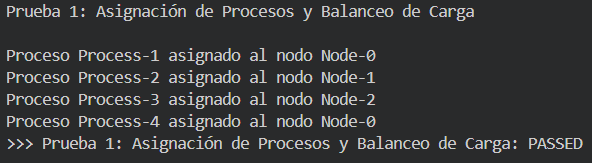
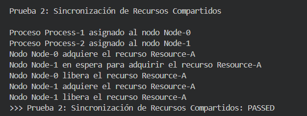
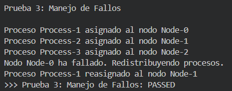
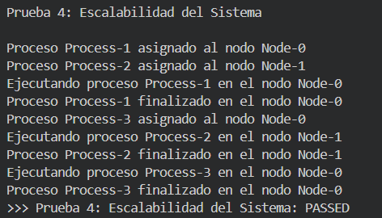
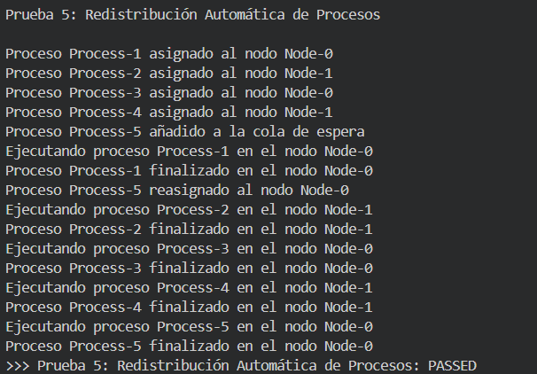

# Simulación de sistema distribuido
Este proyecto es una simulación de un sistema operativo distribuido, diseñado para gestionar recursos y procesos en un entorno simulado con múltiples nodos interconectados. La implementación está orientada a la gestión eficiente de la carga, la tolerancia a fallos y la comunicación entre nodos.

## Project Contributors
- Leonardo Céspedes Tenorio - [LeonardoC1302](https://github.com/LeonardoC1302) - 2022080602
- Kevin Chang Chang - [Swonk888](https://github.com/Swonk888) - 2022039050
- Frankmin Feng Zhong - [frank-the-tankk](https://github.com/frank-the-tankk) - 2022089248

## Arquitectura del Sistema
El sistema se compone de varios componentes clave:
- DistributedSystem: Actúa como el controlador principal del sistema, gestionando la coordinación y la comunicación entre los diferentes nodos.
- Node: Representa una máquina individual en la red distribuida. Cada nodo es capaz de ejecutar procesos y gestionar recursos.
- ProcessManager: Encargado de la creación, asignación y terminación de procesos dentro de los nodos.
- LoadBalancer: Se encarga de distribuir la carga de trabajo entre los diferentes nodos para optimizar el rendimiento.
- FaultTolerance: Implementa mecanismos para detectar y recuperar de fallos en los nodos, garantizando la disponibilidad del sistema.
- Resource: Gestiona los recursos asignados a cada nodo y proceso, asegurando un uso eficiente.

## Mecanismos de Comunicación
La comunicación entre los nodos se lleva a cabo mediante el uso de la clase NodeCommunicator, la cual permite el intercambio de mensajes y la sincronización entre los componentes distribuidos. Se utilizan técnicas de paso de mensajes para asegurar que los datos sean transmitidos de forma fiable y eficiente.

## Sincronización
La sincronización entre nodos y procesos se asegura utilizando varios mecanismos:
- Mutexes: Para prevenir condiciones de carrera al acceder a recursos compartidos.
- Algoritmo de Elección: Implementado para asegurar que solo un nodo tenga control sobre un recurso específico en un momento dado, facilitando la coordinación entre múltiples procesos.
- Coordinación Distribuida: Mediante el uso de algoritmos distribuidos para la gestión de la concurrencia y la prevención de bloqueos.

## Gestión de Fallos
El sistema está diseñado para ser resiliente ante fallos mediante:
- Detección de Fallos: Monitoreo continuo de los nodos para detectar anomalías y fallos.
- Recuperación Automática: Los procesos que fallan son reasignados a otros nodos disponibles para minimizar la interrupción del servicio.
- Módulo de Tolerancia a Fallos: La clase FaultTolerance proporciona estrategias de recuperación a fallos.

## Documentación de Pruebas
El proyecto incluye un archivo Tests.java que contiene pruebas unitarias para verificar la correcta implementación de los componentes del sistema.
### Prueba 1: Asignación de Procesos y Balanceo de Carga
#### Procedimiento
- Asignar procesos a los nodos hasta alcanzar un nivel de carga variable en cada nodo.
- Crear un nuevo proceso y solicitar su asignación.
- Verificar que el proceso se asigna al nodo menos cargado.
#### Resultados Esperados
El proceso debe ser asignado al nodo que tenga menos carga en ese momento.
#### Resultados Obtenidos

### Prueba 2: Sincronización de Recursos Compartidos
#### Procedimiento
- Configurar dos o más nodos para que soliciten acceso al mismo recurso al mismo tiempo.
- Observar el manejo del recurso y verificar que solo un nodo accede al recurso a la vez.
- Liberar el recurso y observar si el próximo nodo en espera lo adquiere.
#### Resultados Esperados
Solo un nodo debe tener acceso al recurso en un momento dado, y los demás deben esperar su turno.

#### Resultados Obtenidos

### Prueba 3: Manejo de Fallos
#### Procedimiento
- Asignar varios procesos a un nodo específico.
- Simular el fallo de dicho nodo.
- Observar la redistribución de los procesos en los nodos restantes.

#### Resultados Esperados
Los procesos deben redistribuirse y ejecutarse en los nodos restantes sin interrumpir el sistema.
#### Resultados Obtenidos

### Prueba 4: Escalabilidad del Sistema
#### Procedimiento
- Ejecutar el sistema con un conjunto de nodos iniciales.
- Agregar nuevos nodos a la red distribuida mientras los procesos están en ejecución.
- Verificar que el sistema integre los nuevos nodos sin interrupciones.

#### Resultados Esperados
El sistema debe aceptar los nuevos nodos y redistribuir la carga de procesos sin interrupciones.
#### Resultados Obtenidos

### Prueba 5: Redistribución Automática de Procesos
#### Procedimiento
- Asignar múltiples procesos a los nodos hasta que uno de los nodos alcance su límite de carga.
- Observar si el sistema redistribuye los procesos excedentes a otros nodos disponibles.
#### Resultados Esperados
El sistema debe redistribuir automáticamente los procesos al nodo más adecuado.
#### Resultados Obtenidos

